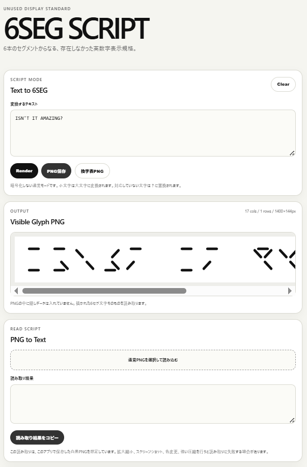
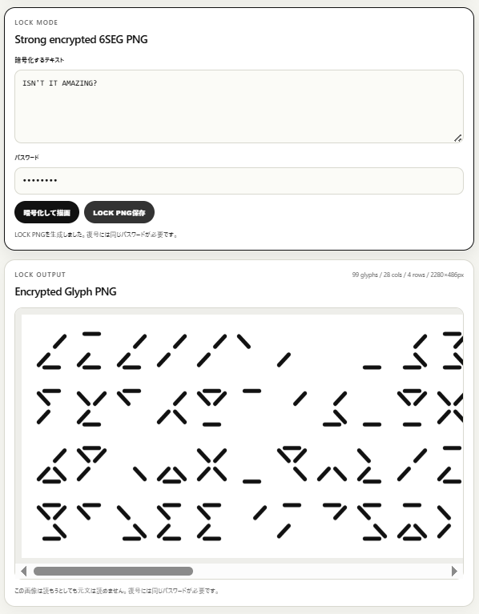
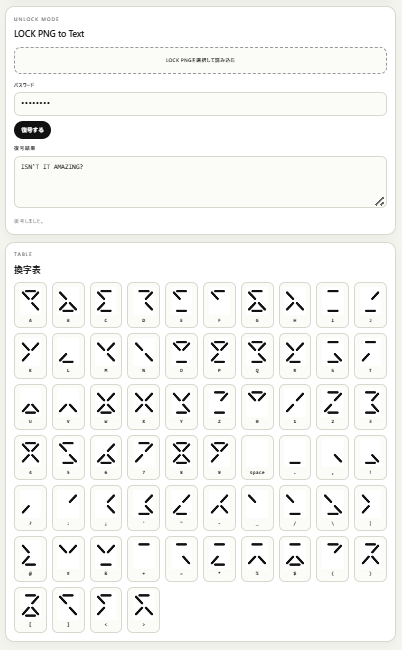

# 6SEG SCRIPT

**6SEG SCRIPT** is a visual writing system based on six segment glyphs.

It started from the 2017 concept **6 SEGMENT LED WATCH** and expands the same six-segment idea from numbers into letters, symbols, readable PNG output, and encrypted PNG output.

## Screenshots

### screenshot1 — SCRIPT MODE / PNG to Text

### screenshot2 — LOCK MODE / Encrypted Glyph PNG

### screenshot3 — UNLOCK MODE / TABLE

## Modes

### SCRIPT MODE

A non-encrypted mode.

- Converts text into readable 6SEG glyphs
- Supports A-Z, 0-9, space, and symbols such as `@`
- Saves as black-and-white PNG
- Reads back the glyphs from the PNG image itself
- No hidden metadata is embedded

This mode is not encryption. It is an unused display standard: unfamiliar at first, but readable once learned.

### LOCK MODE

A strong encrypted mode.

- Encrypts text with **AES-GCM 256bit**
- Derives the key from the password with **PBKDF2-SHA-256**
- Uses random salt and IV for every PNG
- Encodes the encrypted binary data as visible 6SEG glyphs
- Saves as black-and-white PNG
- Reads the visible glyphs back from the PNG and decrypts with the password

The PNG does not contain hidden metadata. The encrypted data is drawn as the 6SEG glyph sequence itself.

> Security note: the encryption method is strong, but security still depends heavily on the password. Use a long, unique password.

## X-readable PNG

v0.3.8 improves **X用PNG保存（読取対応）** and adds **X-safe LOCK export**.

### What changed

- Long text is **automatically split into smaller PNG pages**
- X-readable export now uses a **smaller page size** and a safer grid instead of one very long tiny image
- The X export now downloads **one ZIP containing all PNG pages**, avoiding browser multi-download blocking
- The reader supports **multiple PNG files at once**
- The decoder is more tolerant of **downscaled images**
- LOCK mode also supports **multi-page X-readable PNG export and re-import**

### Why this was necessary

The old v0.2.x X export could produce a single very tall image with tiny glyphs. After posting or rescaling, the app could fail to read it back reliably.

v0.3.8 changes the X workflow so the exported PNGs stay readable more easily. LOCK mode now has a larger X-safe export with triple-repeated glyph data, because even one damaged bit prevents AES-GCM decryption.

### X-safe LOCK export

Encrypted LOCK images are much stricter than normal script images. If Twitter/X resizes or recompresses the image, even a single wrong bit can make AES-GCM reject the whole payload.

v0.3.8 adds **X用LOCK PNG ZIP保存（X再DL対応）**. This mode uses larger glyphs and repeats the encrypted glyph data three times so the reader can recover by majority vote.

For Twitter/X posting, use this mode instead of the normal LOCK PNG export.

### ZIP import

v0.3.8 restores the multi-page workflow more safely on mobile.

- You can still select multiple PNG files when the device file picker supports it
- You can also import the generated ZIP file directly
- This avoids Android / gallery apps that only allow one image at a time

## Features

- Text to 6SEG glyphs
- Normal readable 6SEG PNG output
- PNG-to-text reading from the visible glyphs
- Strong encrypted LOCK PNG output
- LOCK PNG reading and password-based decryption
- Multi-page X-readable export for SCRIPT MODE
- Multi-page X-readable export for LOCK MODE
- X-safe LOCK export with triple-repeated glyph data
- Multi-file reading for split PNGs
- 6SEG substitution table
- Table PNG export
- Static web app / PWA

## How to use

Open `index.html` or deploy the folder to Cloudflare Pages.

For local testing, SCRIPT MODE works directly in a browser.  
LOCK MODE uses the Web Crypto API and is best used on HTTPS, such as Cloudflare Pages.

## Concept

This is not just a font.

It is an unused display standard:
a way of writing letters, numbers, symbols, and encrypted data with the same six-segment structure.

**SCRIPT MODE** is readable if you learn the system.  
**LOCK MODE** is unreadable without the password.

Both use the same visible six-segment surface.

## v0.3.8 note

- SCRIPT PNG reading now forces the exact X-readable grid when the image size matches the generated X pages.
- A visible version indicator was added to the footer.
- Service Worker fetch is now network-first to reduce stale-cache problems.

## Version

v0.3.8

## Author

MASATO / MASATO LAB
